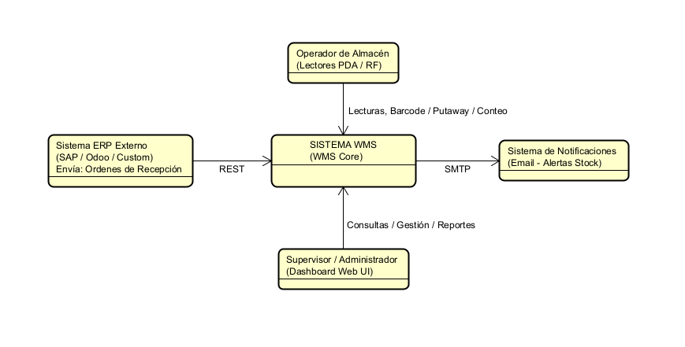

# Modelo C4

## Nivel 1: Diagrama de Contexto (System Context)
El diagrama de contexto muestra las fronteras de nuestro sistema WMS y con quiénes interactúa en el ecosistema logístico.

* Operador de Almacén: Realiza las operaciones físicas en el piso (recepción, asignación de LPN, traslados) a través de interfaces optimizadas para dispositivos móviles/PDAs con lector de código de barras.

* Supervisor/Administrador: Configura el layout del almacén (zonas, posiciones), audita el Kardex, aprueba ajustes de inventario y consulta saldos desde una consola Web Desktop.

* Sistema ERP Externo: Envía la información esperada de recepción (Inbound Orders). El WMS expone un API REST para recibir estos maestros sin depender directamente de la base de datos del ERP.

## Nivel 2: Diagrama de Contenedores (Container Diagram)
Define la pila tecnológica y los componentes ejecutables independientes que componen el WMS.